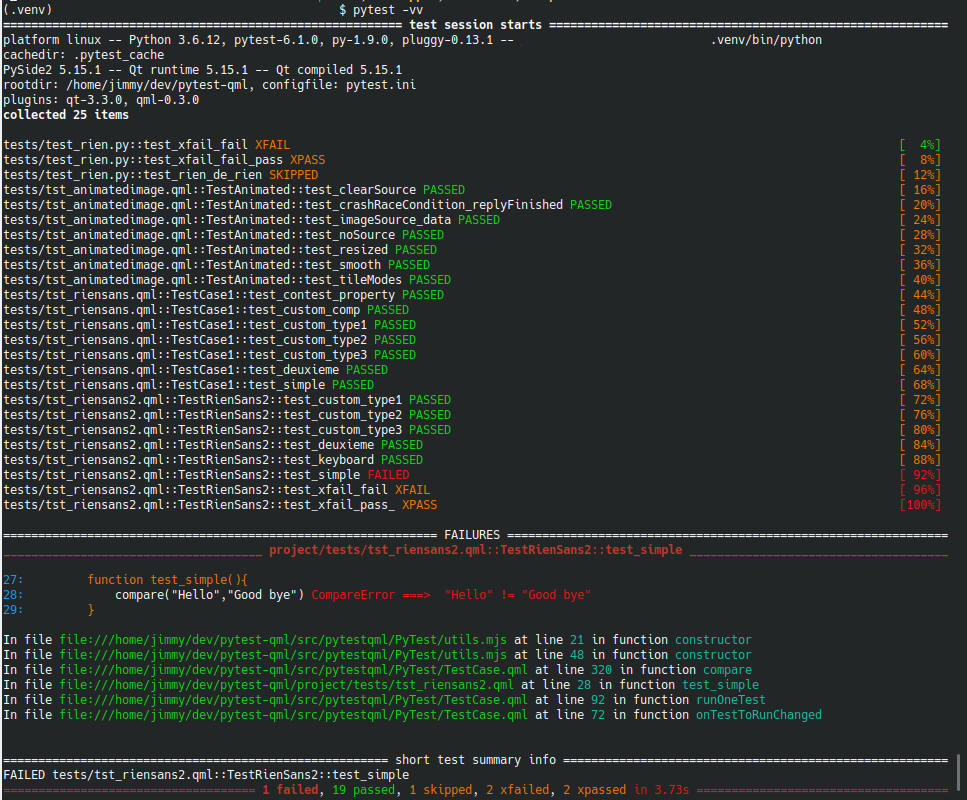

# pytest-qml

## Run QML Tests with PyTest

This pytest plugin allows you to run qml tests via pytest 
instead of the C++/QtQuick test runner. It supports both PySide2 and PyQt5 >= 5.14.2 .

For installation, usage, contributing, please read the doc  [https://jgirardet.github.io/pytest-qml/](https://jgirardet.github.io/pytest-qml/)
